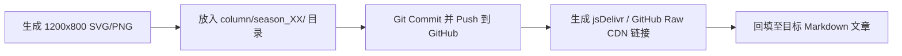

# Aarrebol Image Bed（图床系统与规范指南）

> 本仓库为个人技术博客及《Agent Harness 技术科普专栏》的官方公开静态资源库（Public Image Bed），用于为公众号、Markdown 编辑器、博客及各端 Agent 提供统一、高可用、可溯源的图片访问与 CDN 加速。

- **仓库地址**：[`https://github.com/Aarrebol/images`](https://github.com/Aarrebol/images)
- **维护者**：Aarrebol
- **适用场景**：微信公众号排版、VS Code Markdown 实时预览、Agent 自动化图表交付、技术文档外链。

---

## 一、URL 访问规则与加速方案

本图床支持以下三种标准访问方式，**所有 AI Agent 与自动化脚本在插入图片链接时，均须遵守以下规范**：

### 1. jsDelivr CDN 加速链接（国内推荐，加载极速）
> **格式**：`https://cdn.jsdelivr.net/gh/Aarrebol/images@main/<路径>`

* **特刊 01 架构图示例**：  
  `https://cdn.jsdelivr.net/gh/Aarrebol/images@main/column/season_01/special_01/diagram-01-speckit-workflow.png`
* **备用 Fastly CDN 格式**：  
  `https://fastly.jsdelivr.net/gh/Aarrebol/images@main/column/season_01/special_01/diagram-01-speckit-workflow.png`

### 2. GitHub Raw 原生链接（国际通用 / 微信抓取源）
> **格式**：`https://raw.githubusercontent.com/Aarrebol/images/main/<路径>`

* **特刊 01 架构图示例**：  
  `https://raw.githubusercontent.com/Aarrebol/images/main/column/season_01/special_01/diagram-01-speckit-workflow.png`

---

## 二、目录结构设计规范

所有新上传的静态资源必须归入对应的业务分级目录下，**严禁向根目录随意抛洒图片**：

```text
images/
├── column/                                      # 《Agent Harness 技术科普专栏》专用图床
│   └── season_01/                               # 第一季
│       ├── week_01/                             # Week 01：Agent 与 Harness 认知
│       │   ├── diagram-01-agent-system.png
│       │   └── diagram-01-agent-system.svg
│       ├── week_02/                             # Week 02：工具能力层
│       │   ├── diagram-01-capability-stack.png
│       │   └── diagram-01-capability-stack.svg
│       ├── week_03/                             # Week 03：上下文工作台
│       │   ├── diagram-01-context-workbench.png
│       │   └── diagram-01-context-workbench.svg
│       ├── special_01/                          # 特刊 01：Spec Kit 规格驱动实战
│       │   ├── diagram-01-speckit-workflow.png  # 高清架构流图 (1200x800)
│       │   └── diagram-01-speckit-workflow.svg  # 矢量原稿
│       ├── week_04/                             # Week 04：Loop 控制与恢复
│       └── week_05/                             # Week 05：工作流与自主度
├── blog/                                        # 个人博客与技术文章配图
├── img/                                         # 历史旧配图归档（向下兼容）
├── scripts/                                     # 自动化同步与图床维护脚本
│   └── upload_visuals.py                        # 专栏图片一键增量同步脚本
└── README.md                                    # 规范总文档
```

---

## 三、面向 AI Agent 的标准操作规约（Agent Operation SOP）

当其他 Agent（如 Antigravity、Claude Code、Cursor 或自建脚本）在协助创作文章或生成图表时，必须遵循以下执行流水线：



### 1. 命名规范
* 全部采用**小写英文字母**与**半角中划线 `-`**，禁止包含空格与特殊字符；
* 架构插图统一格式：`diagram-<序号>-<英文主题>.<扩展名>`（例如：`diagram-01-speckit-workflow.png`）；
* 必须成对保存 `.svg`（矢量源文件）与 `.png`（渲染后的最终位图）。

### 2. 视觉与排版标准（适配微信与移动端）
* **标准分辨率**：首图与核心架构图统一输出为 **`1200 × 800`** 像素；
* **移动端阅读字号**：图内最小正文字号不得低于 `16px`，卡片标题不得低于 `18px-24px`，确保手机端不放大也能清晰辨认；
* **色彩基调**：遵循专栏统一规范（背景浅灰蓝 `#F8FAFC`，主体卡片带柔和圆角 `rx="14"`，主色科技蓝 `#2563EB` 与门禁橙 `#D97706`）。

### 3. 一键同步命令
在完成新图片的绘制后，Agent 可直接在 `images/` 根目录执行同步脚本：
```bash
python scripts/upload_visuals.py
```
脚本会自动扫描 `agent_harness_column` 中的所有 `visuals/` 文件夹，自动增量复制、提交并推送到 GitHub 远程仓库！

---

## 四、VS Code 插件 `vscode-markdown-to-wechat` 最佳配置指引

针对使用 `vscode-markdown-to-wechat` 插件时“本地图片红叉破损”的问题，请按以下方案配置：

### 方案 A：在 Markdown 中直接使用本图床全路径（推荐，零配置）
直接在 Markdown 文件中使用 CDN 全路径，例如：
```markdown

```
* **效果**：VS Code 预览面板立即加载，无需任何插件设置；复制粘贴进微信公众号后台时，微信爬虫会自动抓取并转存到官方素材库！

### 方案 B：在插件中配置 `imageDomain`（图片域名）
如果在 Markdown 中仍然使用相对路径（如 `./visuals/diagram-01-speckit-workflow.png`）：
1. 在 VS Code 微信预览面板右上角点击 **⚙️ 设置**；
2. 找到 **“图片域名”**，填入当前文章对应的图床基准前缀，例如：
   ```text
   https://cdn.jsdelivr.net/gh/Aarrebol/images@main/column/season_01/special_01
   ```
3. 插件会自动把相对路径补全为 CDN 路径，实现无缝预览与无感复制！

---

## 五、版本与维护记录

| 日期 | 版本 | 变更内容 | 操作人 |
| :--- | :--- | :--- | :--- |
| 2026-09-23 | v1.1.0 | 建立专栏分级图床架构，同步 Week 01~05 及特刊 01 配图，编写 Agent 接入规范与自动化同步脚本 | Antigravity |
| 2025-11-27 | v1.0.0 | 初始化基础图片仓库 | Aarrebol |
